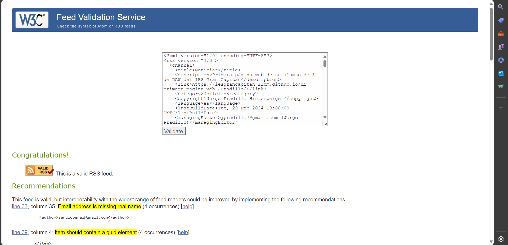
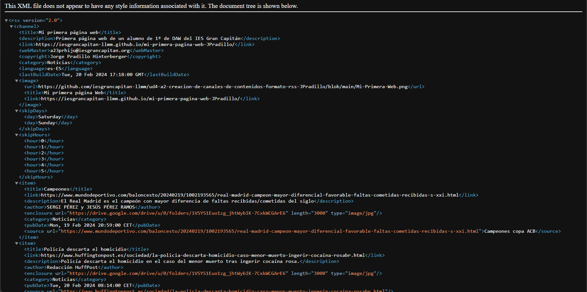
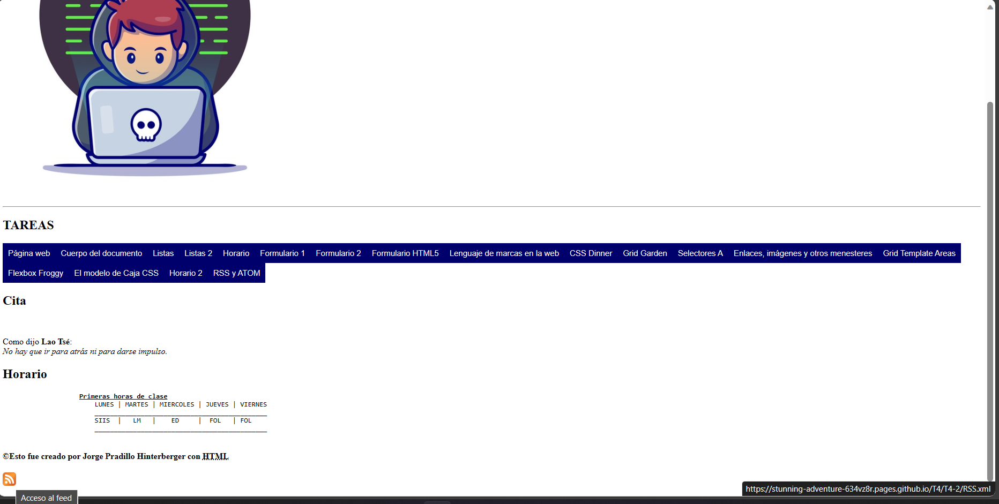

# UD4 A2. Creación de canales de contenidos. Formato RSS

Ya sabemos lo que es RSS y ATOM y cómo los lectores de contenidos permiten la lectura de las noticias gracias a ambas tecnologías. 
Ahora vamos a crear documentos RSS y ATOM para redifundir noticias sobre un tema concreto. La información que se oferta en la fuente RSS depende del propietario del sitio web.
Normalmente es una lista de las últimas publicaciones o entradas del sitio web  ordenadas en orden cronológico. Algunas fuentes RSS contienen metadatos adicionales, como imágenes, enlaces de medios, enlaces alternativos, autor, un breve resumen, etc.

## Formato RSS

RSS es un formato de sindicación de contenido web. Su nombre es un acrónimo de Really Simple Syndication.

RSS es un dialecto de XML. Todos los archivos RSS deben cumplir con la especificación XML 1.0, tal como se publica en el sitio web del World Wide Web Consortium (W3C).

El nivel superior de un documento RSS es un elemento &lt;rss&gt;, con un atributo obligatorio llamado versión, que especifica la versión de RSS a la que se ajusta el documento, por ejemplo,  2.0.

Subordinado al elemento &lt;rss&gt; hay un solo elemento &lt;channel&gt;, que contiene información sobre el canal (metadatos) y su contenido.

## Etiquetas obligatorias 
  Dentro de la etiqueta channel aparecen las siguientes etiquetas obligatorias:
  - title: El nombre del canal. Es cómo la gente se refiere a su servicio. Si tiene un sitio web HTML que contiene la misma información que su archivo RSS, el título de su canal debe ser el mismo que el título de su sitio web. 
  - link: La URL del sitio web HTML correspondiente al canal.
  - description:  Frase u oración que describe el canal.
  
  Un canal puede contener cualquier número de &lt;item&gt;s. Si un &lt;item&gt;  representa una "historia", su descripción es una sinopsis de la historia, y el enlace apunta a la historia completa. Un &lt;item&gt;  puede estar completo en sí mismo, si es así, la descripción contiene el texto (se permite HTML codificado por entidad), y el enlace y el título pueden omitirse. Todos los elementos de un &lt;item&gt; son opcionales, sin embargo, al menos  el &lt;title&gt; o la &lt;description&gt;  deben estar presentes.
  
## Etiquetas opcionales del canal
  Además de las obligatorias, existen otras etiquetas opcionales como:
  - language: El idioma en el que está escrito el canal. Esto permite a los agregadores agrupar todos los sitios en español, por ejemplo, en una sola página. 
  - webMaster: Dirección de correo electrónico de la persona responsable de los problemas técnicos relacionados con el canal. Es el editor o administrador del sitio web
  - category: Especifica una o más categorías a las que pertenece el canal. Sigue las mismas reglas que el elemento de categoría de nivel &lt;item&gt;.
  
## Requisitos de la entrega

Realizarás una entrega [RSS](../RSS.xml) con los siguientes elementos:
- Los elementos obligatorios del canal. (Título, enlace y descripción)
  - El enlace será el link de tu Github Pages (tarea UD3 A6. Mi sitio. Github pages).
- Categoría y autoría del canal.
- Idioma, fecha de última actualización y dirección de correo del alumno como administrador del canal.
-  El canal no se actualizará los sábados y domingos. Y las horas de 00:00 a 5:00 horas
- Una imagen obtenida de Internet y que ilustre la temática del canal. Se puede subir la imagen a github o drive y utilizar el link de la imagen ya que no puede ser un link de un path de tu equipo. Si es de drive recuerda darle permisos.
- 4 artículos, como mínimo, con diferentes orígenes y los siguientes elementos.
  - Los elementos obligatorios del artículo.  
  - Autor del artículo.
  - Un archivo multimedia que podrá ser vídeo, audio o imagen.
  - Fecha de publicación.
  - Fuente del artículo.


## Validación

Este es el  [servicio de validación de fuentes W3C](https://validator.w3.org/feed/), un servicio gratuito que verifica la sintaxis de las fuentes Atom o RSS. En la parte inferior veremos el enlace the “valid RSS” banner en el que podemos
descargar el logo de RSS válido para utilizarla en nuestra web. A continuación nos ofrece un
elemento &lt;a&gt; de HTML para incluir en nuestra web que permitirá al usuario comprobar la
validación de nuestro RSS. 
  
Adjunta una captura de pantalla con la validación del feed en el validador de W3C.


  
## Publicación
  Para hacerlo accesible a los demás, y una  vez escrito y validado nuestro archivo hay que subirlo al servidor Web. Usa el repositorio con el hosting activo (Tarea UD3 A6. Mi sitio. Github pages) Para ello:
- Inserta un enlace en la página de inicio de nuestra web que apunte al archivo RSS
para poder consultarlo a través del navegador. Usa el icono estándar de sindicación
de contenidos

```html
<p><a href="ud4_a2.xml">
   
</a></p>
```

- Inserta un elemento <link> en la cabecera de la página de inicio para que los
lectores o agregadores RSS suscribirse a nuestro feed. Dentro del elemento <head> de la página de inicio de nuestro sitio web pondremos
el siguiente elemento.

```html
<link href="ud4_a2.xml" rel="alternate" type="application/rss+xml" title="RSS 2.0">  
```
Indica aquí la url de tu sitio web.
  

  
## Suscripción
Utiliza el lector/agregador  feedly para añadir el fichero RSS que has creado.

  Muestra una captura del contenido de la sindicación del contenido




  
De interés:
- https://www.w3schools.com/xml/xml_rss.asp
- https://www.w3schools.com/xml/rss_tag_skipDays.asp
- https://www.w3schools.com/xml/rss_tag_skipHours.asp
- https://youtu.be/0uNZDzi_jYs
- https://www.rssboard.org/rss-specification
- https://validator.w3.org/feed/docs/rss2.html
- https://validator.w3.org/feed/docs/rss2.html#requiredChannelElements


  
